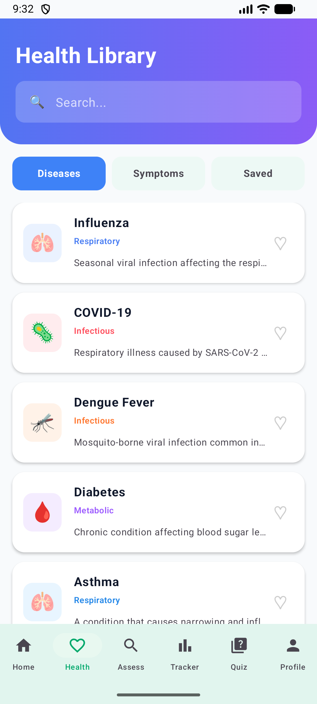
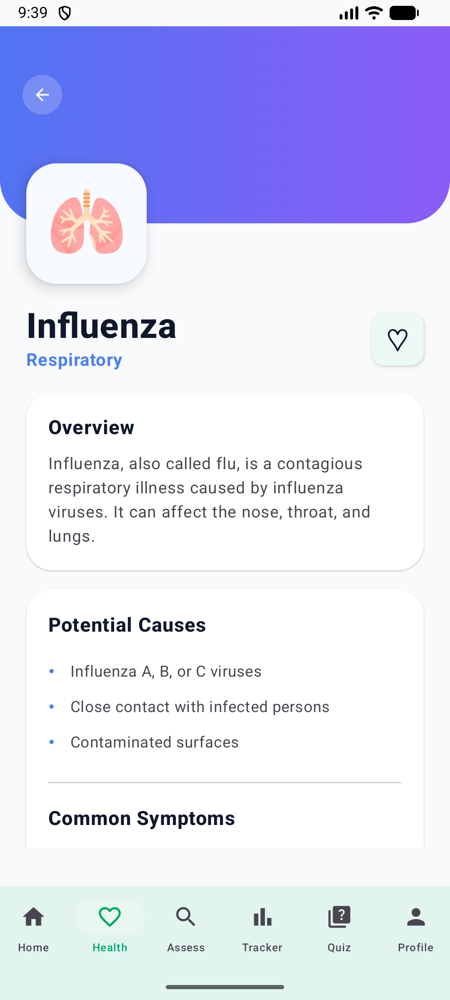
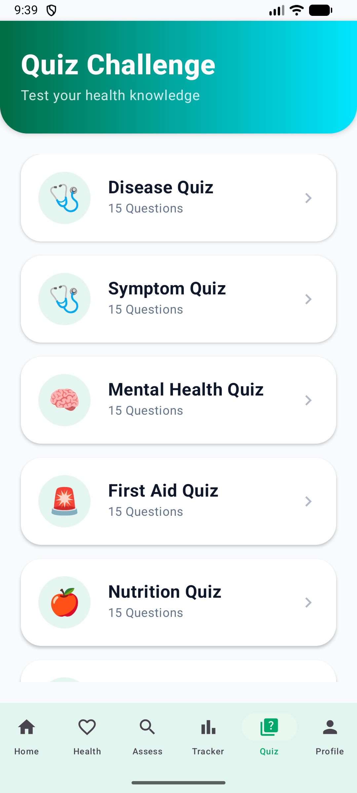
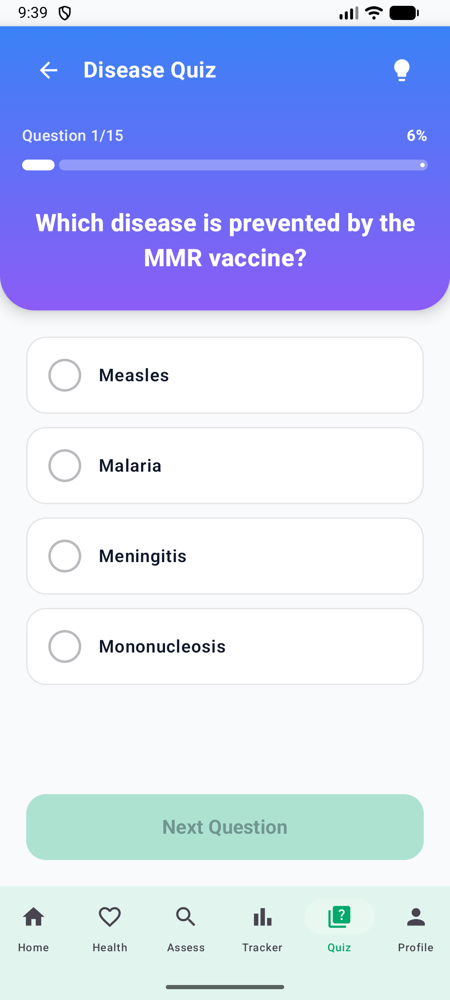
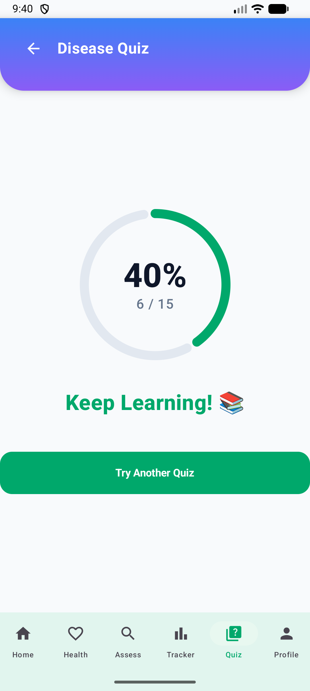

## Project Overview
The Health Awareness and Education System is an Android application designed to provide users with useful health information and promote health awareness 
through educational content and interactive quizzes.

## Technologies Used
- Kotlin
- Android Studio
- XML
- Android SDK

## Project Type
Group Project

## My Contribution
I was mainly involved in the Health Library and Quiz modules. For the Health Library, I developed the functions for displaying and 
organizing health-related information into different health topics and categories. Users can select a health topic to view its 
detailed information, including an overview, causes, symptoms, and prevention methods. I also worked on the layout and 
navigation of the health information pages to make the content clear, organized, and easy for users to read. 

## Screenshots
### Health Library

### Health Topic Details

### Quiz

### Quiz Questions

### Quiz Results

## How to Run
1. Clone this repository.
2. Open the project in Android Studio.
3. Allow Gradle to sync.
4. Build and run the application on an Android emulator or Android device.
